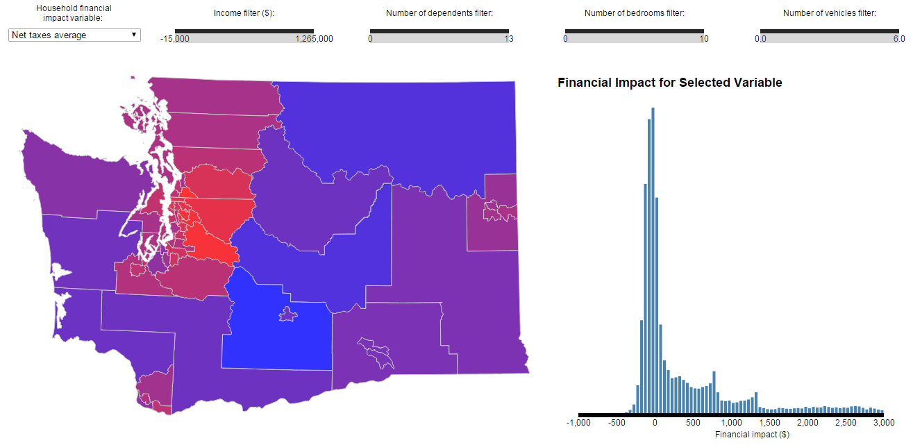

# Visualizing the Statewide Impact of a Revenue-Neutral Carbon Tax

Link to the webpage:

http://cse512-15s.github.io/fp-jbare-kaul10-lizehang-nanand/

#Team: 
Justin Bare  
Nandita Anand  
Aditya Kaul  
Zehang Richard Li

#Summary Image:

#Abstract:
We envision using online tools to introduce information into the political sphere in ways that are transparent and fair, and that hold the producers of facts accountable for the information they provide. As a prototypical example, we are developing an online calculator for a revenue-neutral carbon tax proposal in the state of Washington. The data visualization discussed here is one of the features of this tool aimed at facilitating voters' understanding of the policy and its impacts. We hope that features such as these will provide a basis of information from which democratic processes can proceed more effectively. Following the tradition of exploratory visualizations, our tool allows users to find their own insights from a large body of data using various filtering options and both broad and specific views of the data. 

Poster is available [here](http://cse512-15s.github.io/fp-jbare-kaul10-lizehang-nanand/final/poster-jbare-kaul10-lizehang-nanand.pdf)

Final paper is available [here](http://cse512-15s.github.io/fp-jbare-kaul10-lizehang-nanand/final/paper-jbare-kaul10-lizehang-nanand.pdf) 

#Software instructions:
Go [here](http://cse512-15s.github.io/fp-jbare-kaul10-lizehang-nanand/combinedVis.html) to access the visualization or download this repository and run python -m SimpleHTTPServer 8888 and access this from http://localhost:8888/.

#Division of Labor:
All members in the group participated in regular discussion, literature review, and writing. Each member's focus is provided below:

* Justin Bare  
 + Data retrieval, cleaning, and computation
 + Filtering and variable selection
 + Map geographic boundaries display and coloring
 + Histogram computation and design
 + Mouse event update scheme
 
* Nandita Anand  
 + ...
 + ...
 
* Aditya Kaul  
 + ...
 + ...
 
* Zehang Richard Li
 + Navigate and locate external dataset to combine with the main PUMS data.
 + Perform data cleaning and missing data imputation.
 + Pre-compute aggregated data table and bubble locations in the bubble chart.
 + Implement the bubble chart, including interaction with the main map.

#Research/Development Process:
